=============
Setup Manual
=============

Introduction to Baobab LIMS
==========================

Baobab LIMS is a Laboratory Information Management System (LIMS) designed for the collection, processing and storage of human biospecimens. The system was designed a priori using the Standard operating procedures (SOPs) of the NHLS-Stellenbosch University Biobank. Baobab LIMS comprises modules for biospecimen kit assembly, biospecimen shipping, storage management, analysis requests, reporting and invoicing. Current developed SOPs define the biobanking activities of the Biobank and in an effort to extend the usability of the system, collaborations which incorporate SOPs generated by other Biobanking facilities, are ongoing. The figure demonstrates the workflow of the current system, deduced from SOPs. 

Baobab LIMS is both Free and Open Source with some modules being inherited from Bika LIMS. Furthermore, Baobab LIMS can be customized to the specific needs of your laboratory.

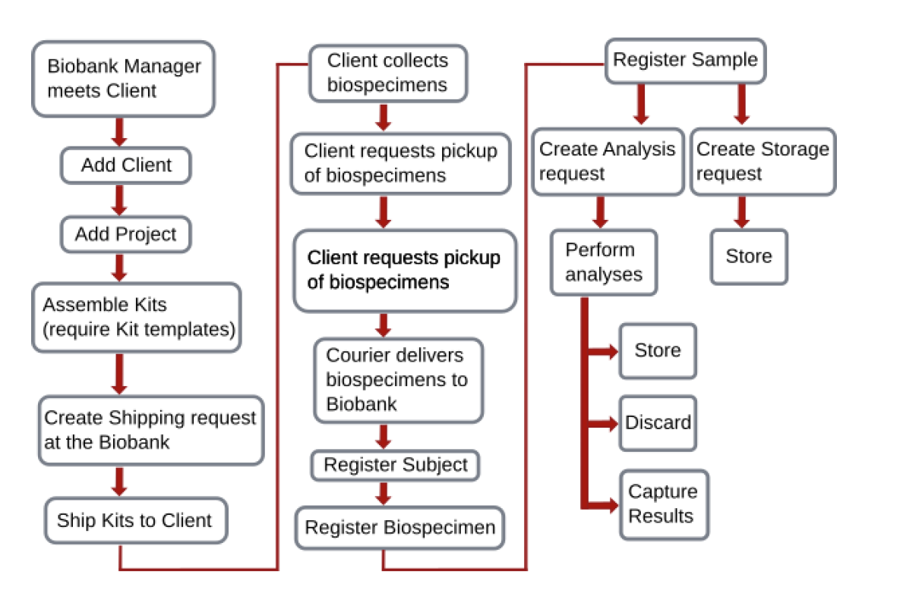

For more additional resources, use the following link to `github`_, or read the parer `here`_

.. _github: https://github.com/SANBI-SA/baobab.lims
.. _here: https://www.ncbi.nlm.nih.gov/pmc/articles/PMC5397207

Install your Baobab distribution
================================

Go to https://<server IP address>/manage_main 
Select ‘Add Plone site’

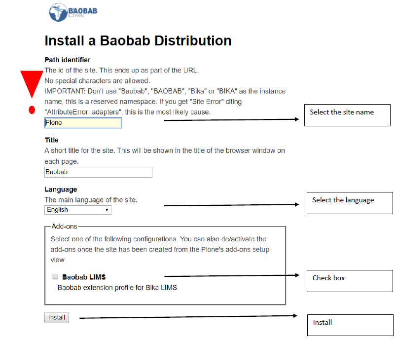

.. warning::

    It is important that you do not use "baobab", "BAOBAB", "BIKA" or "bika" in your instance name. This is a reserved namespace and a "site error" will occur

Change the Baobab Theme
=======================
The Baobab theme can be changed to the graphite theme. The graphite theme has an easy access navigation panel at the top of the page and a site map.

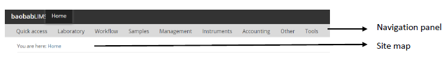

Follow the instructions below to change your theme;

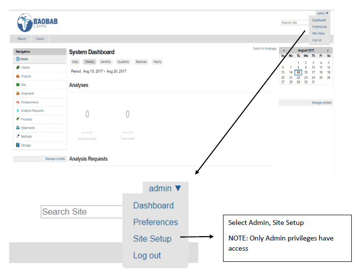

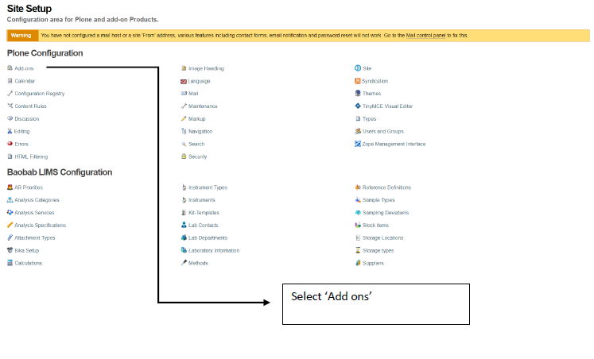

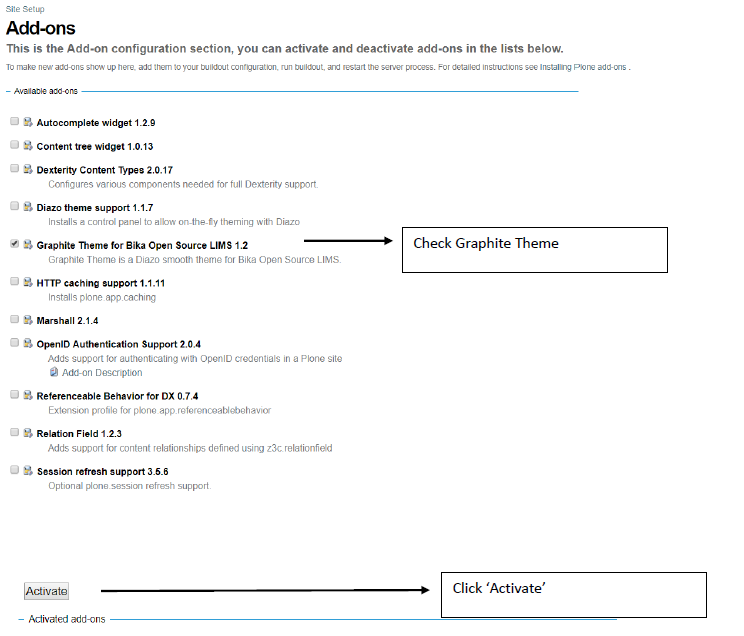

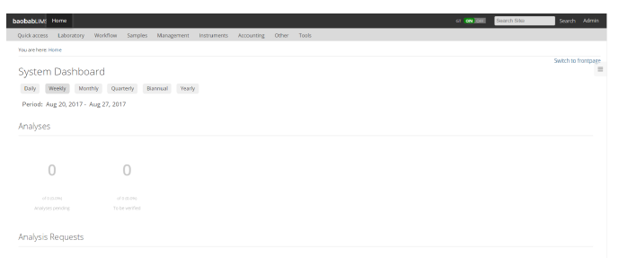

The figure above represents the homepage of the Graphite theme.

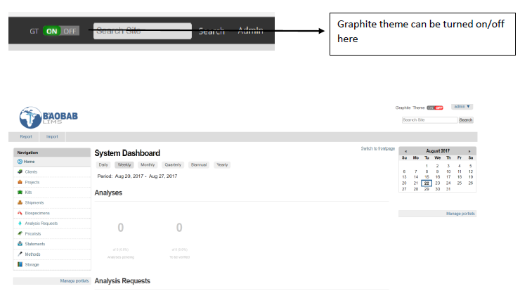

The figure above represents the homepage if the graphite theme has been disabled.

Your Baobab distribution
========================

With your installation complete, you can now set up your site. Baobab LIMS requires that your site is set
up before you can start to manage clients and projects and certain compulsory information is required for
each step and is indicated by a red square or asterix. As such, we recommend that you follow this setup section in a stepwise manner.

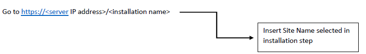

This will open the homepage for your distribution.

Set up your mail settings
-------------------------

As the administrator for the site, the mail settings will need to be configured, the page will display the
following error.

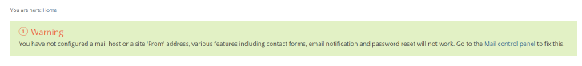

To set up the mail settings select the ‘Mail control panel’ link in the error message. Alternatively, go to
‘site setup’ and select the ‘Mail’ tab.

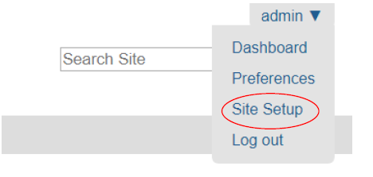

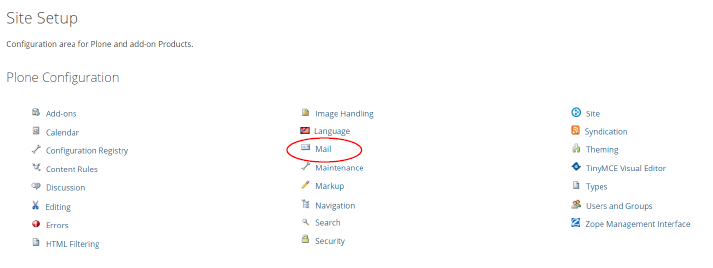

You will be automatically directed to the ‘Mail settings’ page where you will be required to enter the SMTP
server address and will be able to set the administrator username and password. Ensure that all the
required fields are completed and select ‘save and send test email’.

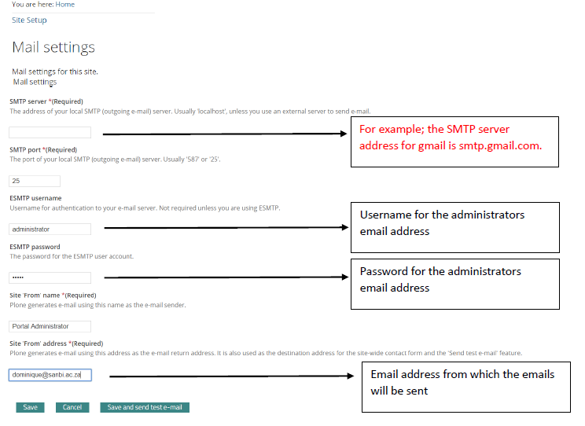

Following successful set-up, you will receive an email confirming that the email server is working.

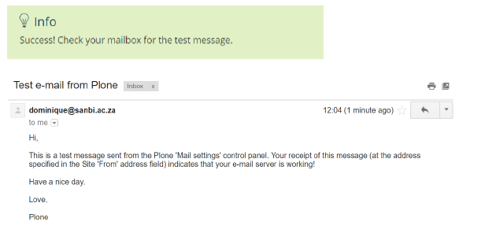

.. warning::For Gmail users, the following error may occur due to the security settings on your Gmail account which will prevent sign-in from another device or app.

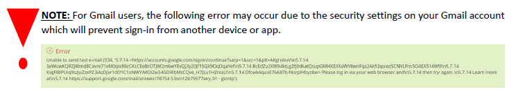

Please ensure that your Gmail settings permit the site to access your account. Use the following ``link`` to understand more; 

.. _link: https://support.google.com/accounts/answer/6010255

Set up your laboratory
-----------------------

Mouse over the ‘Laboratory’ Tab and select ‘Laboratory’

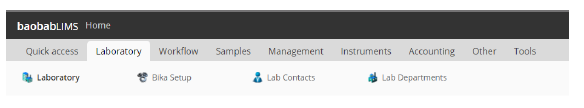

Enter the details of the laboratory and press ‘save’. Compulsory fields are indicated by a red square.

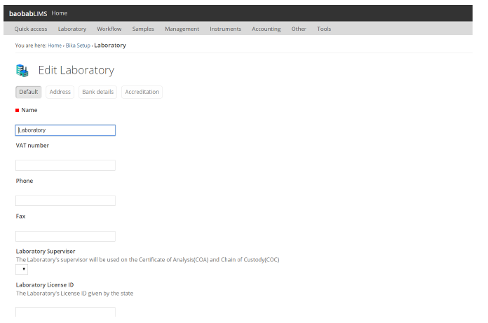

Mouse over ‘Laboratory’ and select ‘Lab Contacts’
Add a lab contact by selecting the ‘add’ button

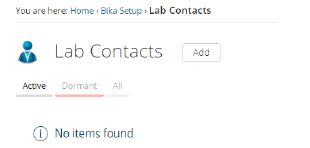

Enter the details of the lab contact and press ‘save’. Compulsory fields are indicated by a red square
Select the ‘email, telephone, fax’ tab, enter the email address of the lab contact and press ‘save’.

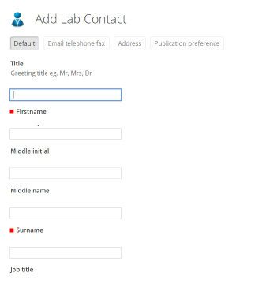

Select ‘Login details’

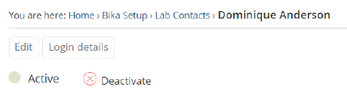

Enter the details of the user and press ‘save’

An email will be sent to the users email address

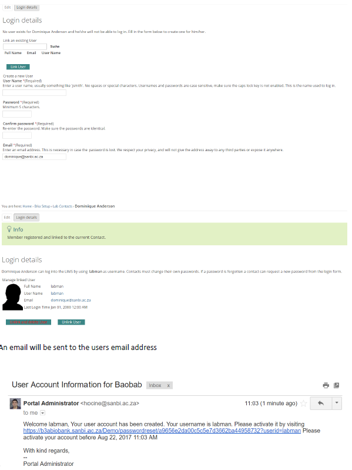

Select the link to activate the account and change the password

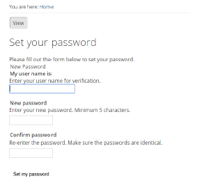

Set the new password and the user will now be able to login

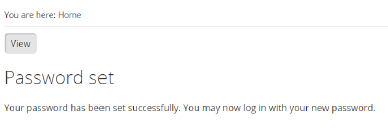

Mouse over ‘Laboratory’ and select ‘Lab Departments’
Add a lab department by selecting the ‘add’ button. Compulsory fields are indicated by a red square.

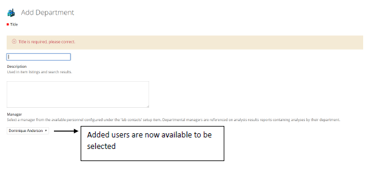

Set up your suppliers
---------------------

Mouse over the ‘management’ tab and select ‘Suppliers’

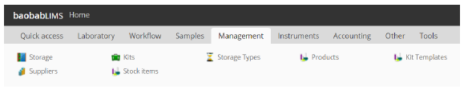

Add a supplier by using the ‘Add’ button
Enter the details of the supplier and press the ‘save’ . Compulsory fields are indicated by a red square.

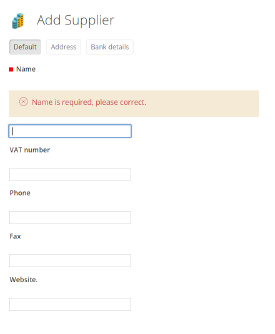

Once a supplier has been added, contacts, instruments and inventory orders associated with the supplier can be added. Note that products belonging to the supplier must be added using the ‘Products’ tab.

Mouse over the ‘management’ tab and select ‘Products’
Add a product by using the ‘Add’ button

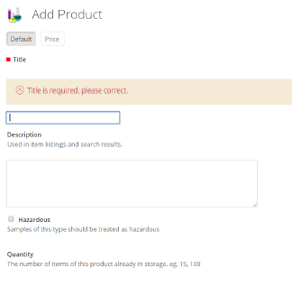

Enter the details of the product and press the ‘save’ . The suppliers which you added in the previous step will be available from the drop down menu. 

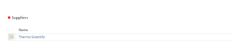

Compulsory fields are indicated by a red square.

Once products associated to suppliers have been added, the products are now available to be selected in the ‘Suppliers’ tab.

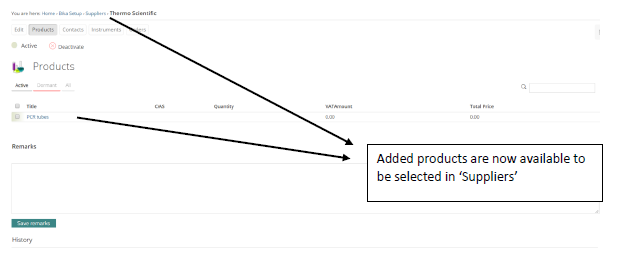

Set up your instruments
-----------------------

Mouse over the ‘Instruments’ tab and select ‘Instrument types’

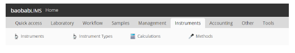

Add an instrument type by using the ‘Add’ button

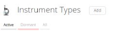

Enter the details of the instrument type and press the ‘save’ . Compulsory fields are indicated by a red square.
Once instrument types have been added, select the ‘Instruments’ tab. Add an instrument using the ‘Add’ button. Enter the details of the instrument and press ‘save’. Compulsory fields are indicated by a red square.

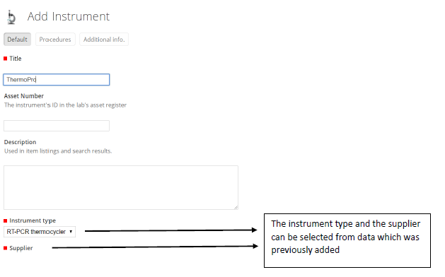

Once an instrument has been added, a notification of expired calibration certification will appear and additional tabs will become available for editing.

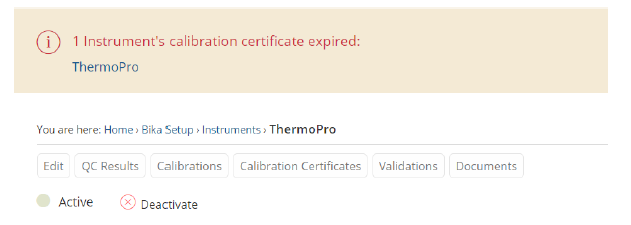

Select the ‘Calibration Certificates’ tab and add a certification specifically related to the instrument using the ‘Add’ button. Enter the details of an instruments calibration and press ‘save’. Compulsory fields are indicated by a red square.

If the calibration dates are current, the notification which occurred, will automatically be removed

Set up your storage types
-------------------------

Mouse over the ‘Management’ tab and select ‘Storage Types’

.. image:: _static/setup_images/su34.PNG

Add a storage type by using the ‘Add’ button

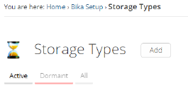

Enter the details of the storage type (e.g. a freezer) and press the ‘save’. Compulsory fields are indicated by a red square.

Set up your storage
-------------------

Mouse over the ‘Management’ tab and select ‘Storage’

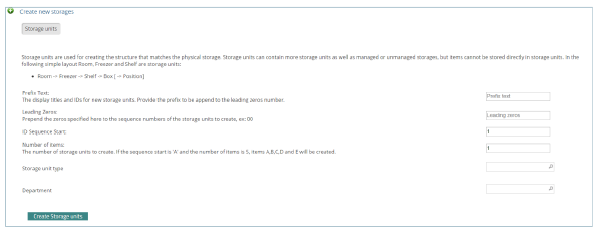

Prefix text: such as room, shelf, box
Leading zeros: denotes the prefix number
ID sequence start: the number on which the prefix should start
Number of items: How many units with the prefix must be created
Storage unit type: become available once defined in the ‘Storage types’ (This is only applicable at the level below a room eg: a freezer)
Department: becomes available once defined in the ‘departments’ section in ‘set up your laboratory’
Enter the details of the storage and press ‘create storage units’

Once a storage has been created, the storage unit can be selected and a hierarchical storage system can be created for each unit.
Example: Room > Freezer > Shelf > Box > Position

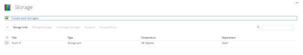

Select the ‘Room’ initially created. Enter the details of a new storage unit and press ‘create storage unit’

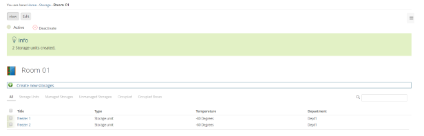

Select a freezer storage unit that has been created. Enter the details of a new storage unit and press ‘create storage unit’

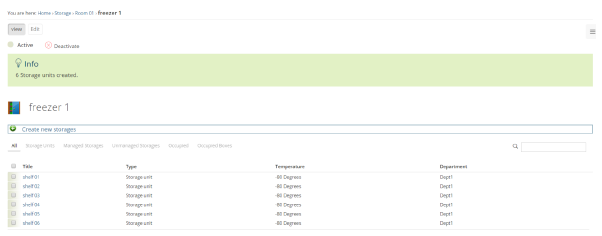

Select a shelf storage unit that has been created. Enter the details of a new storage unit and press ‘create storage unit’

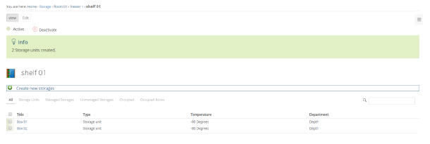

At each level of a storage unit creating, space can be managed (ie. Spaces are assigned) or unmanaged (ie. Spaces are not allocated prior to storage).

Managed storage
---------------
Managed storage is used specifically for the storage maintenance of biospecimens. The process of creating managed storage is as follows;

Navigate to the storage unit created in the previous step and select the ‘managed storage’ tab.

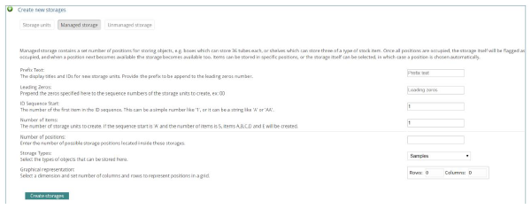

Enter the details required to create managed storage and press ‘create storage’.
By selecting the created storage unit, a list of created positions will be shown. In addition, a graphical display is available.

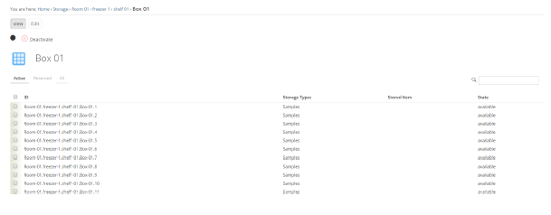

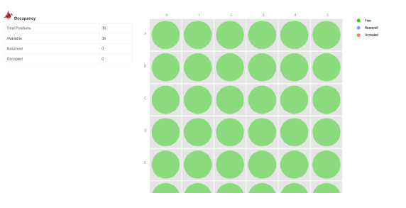

By selecting a storage unit (a position within a box), the item may be reserved. When the item is reserved, the state of the item will change and this change will also be reflected in the graphical representation.

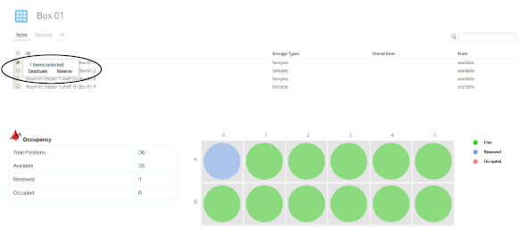

The storage position can be freed by selecting the position and pressing ‘liberate’.

.. image:: _static/setup_images/su45.PNG

Unmanaged storage
-----------------
Unmanaged storage refers to locations for items such as inventory stock items that will be used in kit assembly. The process of creating unmanaged storage is as follows;

Navigate to the storage unit created previously and select the ‘add new storage’ button. Navigate to the ‘unmanaged storage’ tab and enter the details of the storage.
In the example below, Room01 contains 3 shelves for storage of inventory items. The shelves are labeled from 1 to 3 and will contain stock items.

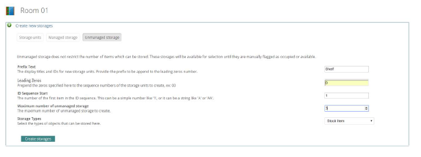

Set up your stock items for unmanaged storage
---------------------------------------------

Go to ‘Suppliers’ and navigate to the ‘Orders’ tab. Select ‘Add’ and enter a quantity which you would like
to order and press ‘save’.

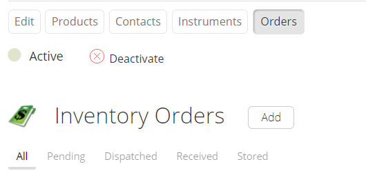
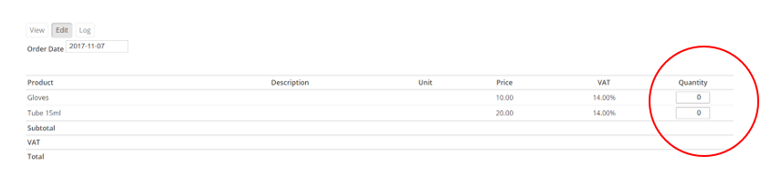

Select ‘Dispatch the order’ and wait to ‘publish’, which opens in a new tab.

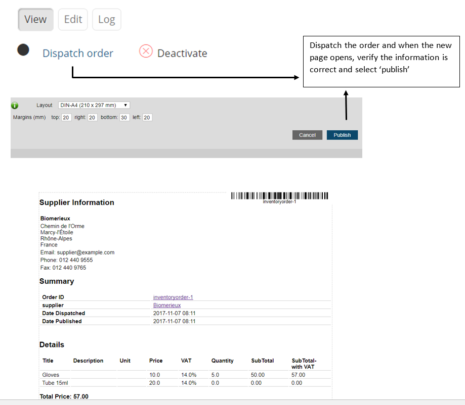

Once published and you have received the order, you can change the state of the order to ‘receive order’.

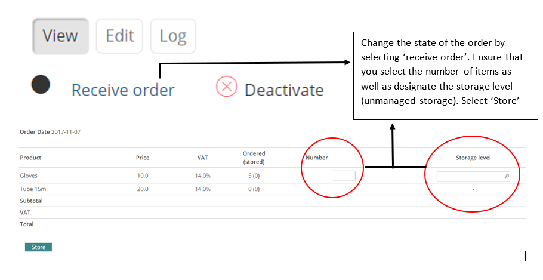

Now you can change the state of the item by selecting 'store order'

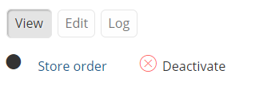

Set up your analysis category
-----------------------------

Mouse over the ‘Workflow’ tab and select ‘Analysis category’

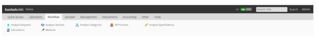

Add an analysis category by using the ‘Add’ button

Enter the details of the analysis category and press the ‘save’. Compulsory fields are indicated by a red square.

Set up your Analysis services
-----------------------------

Navigate to the ‘Workflow’ tab and select ‘Analysis services’.

Add an analysis service by using the ‘Add’ button

Enter any details related to your analysis services and press ‘save’ Compulsory fields are indicated by a red square.

Set up your Samples
-------------------

Mouse over the ‘Samples’ tab and select ‘Sample Types’

Add a sample type by using the ‘Add’ button

Enter the details of the sample type and press the ‘save’. Compulsory fields are indicated by a red square.

Set up your other parameters
----------------------------

Once all the above categories have been set up, all other categories can be set up. These can be managed by simply selecting the category and adding information using the ‘Add’ button. Enter details related to the category and press the ‘save’ button. Compulsory fields are indicated by a red square.

