Baobab LIMS User manual
=======================

This manual will guide you through the process of creating projects and the associated data related to projects. This manual is for use FOLLOWING the setup of your lab (see ‘SETUP’ manual).

.. warning::

    Please make use of the user manual following the setup of your site

Plone Configuration
--------------------

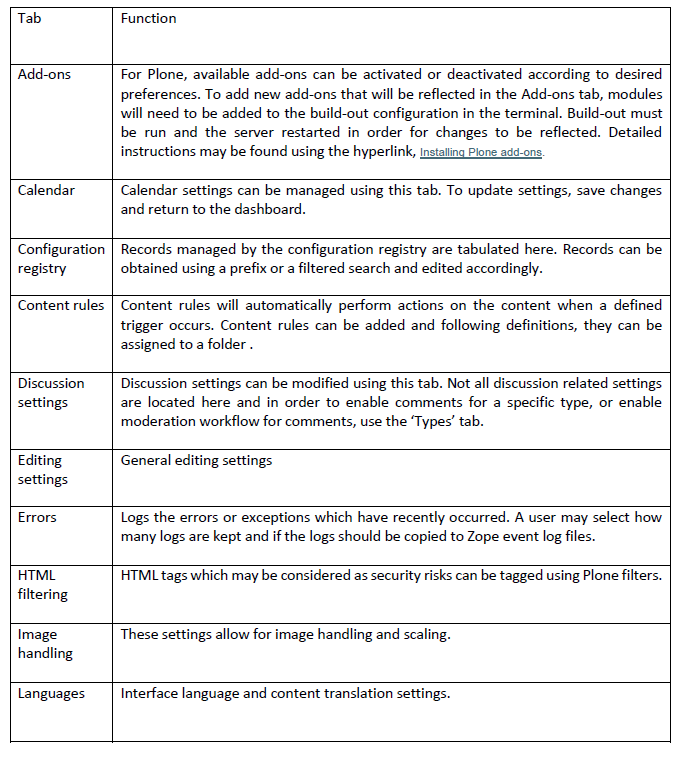

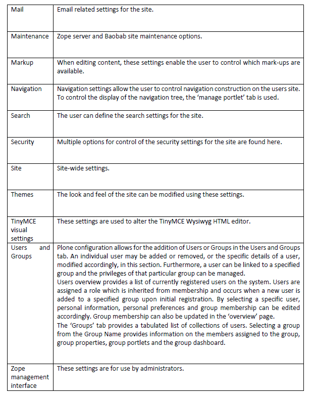

Baobab LIMS Configuration
-------------------------

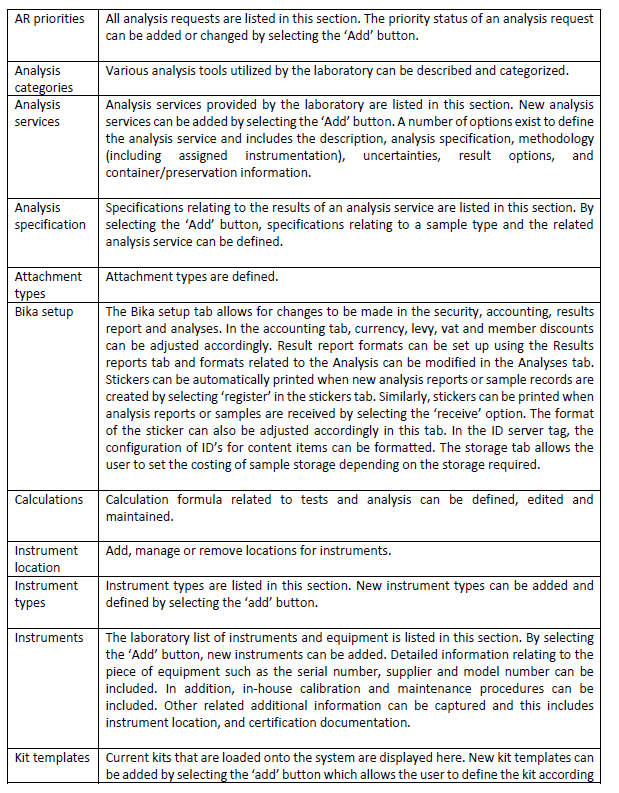

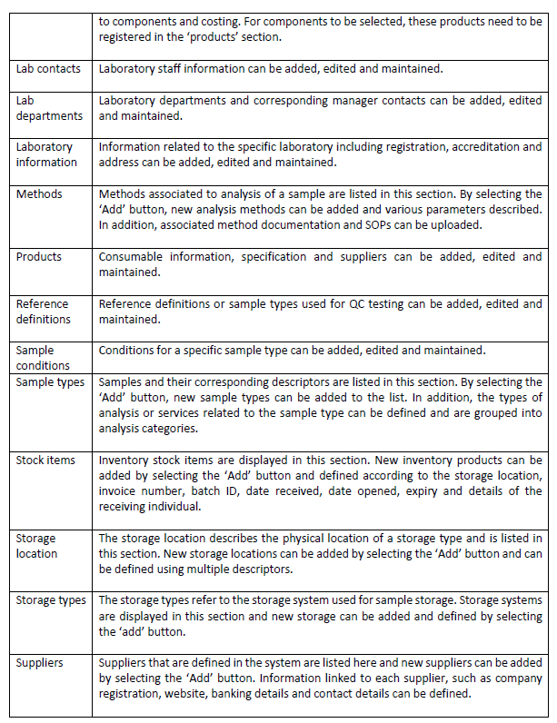

Add client
-----------

Mouse over ‘quick access’ and selecting the ‘Clients’ tab. All added clients are listed in this section.

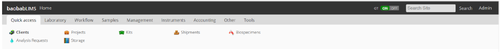

Add a client by selecting the ‘Add’ button. Enter the details of the client and press the ‘save’ button.
Compulsory fields are indicated by a red square.

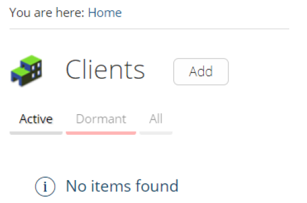

Client information includes address, bank details, preferences and licenses and can be added by selecting
the required tab and entering the information.

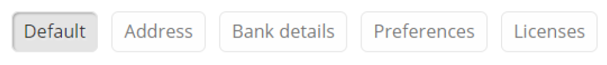

Add project
------------

In the clients list, select the client of interest which will automatically take you to the ‘projects’ page. A notification may appear requesting for client contact information to be submitted.

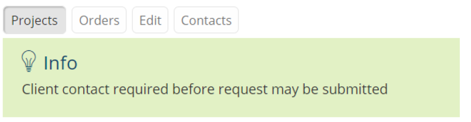

Proceed to the ‘Contacts’ tab above the notification and select the ‘add’ button. Enter the details and press the ‘save’ button. Compulsory fields are indicated by a red square.

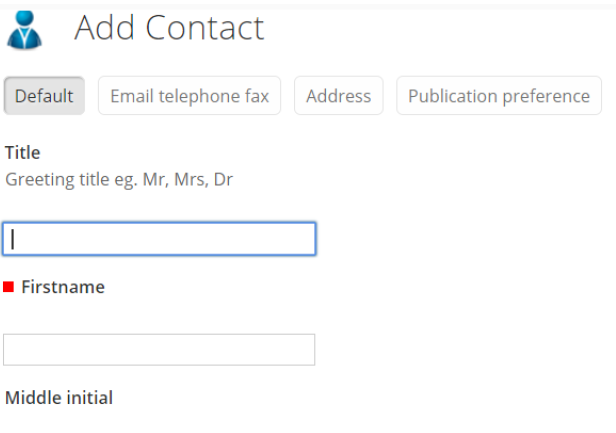

By adding a client contact details, the login details of the contact can be edited by navigating to the ‘Login details’ tab.

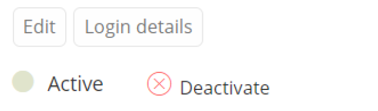

The login details for the Client contact can be added and the once saved, the client will receive an email indicating the username and password. The client can login to the LIMS site using these details, but will have limited access to modules on the site (as stipulated by the user role). User roles can be defined by the administrator in the ``plone configuration`` under the tab ``Users and Groups``.

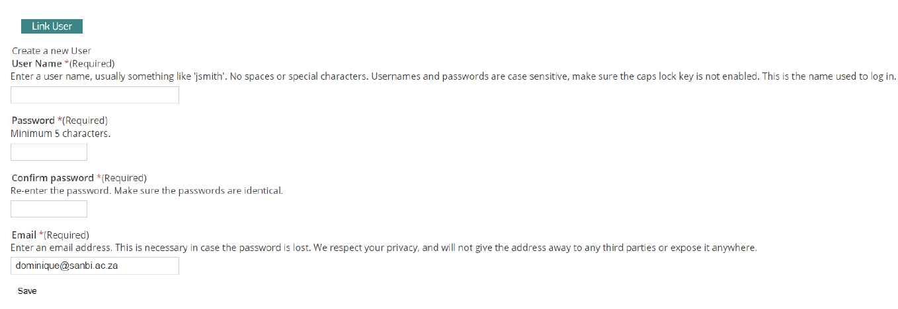

Projects
---------

The Biobank user can now be directed to the ‘projects’ page for the specific client. Add a project by selecting the ‘Add’ button and enter the details of the project. Compulsory fields are indicated by a red square. The user will be automatically directed to the created project page where tabs for kits, shipments, biospecimens and analysis requests can be selected, and items can be added or viewed.

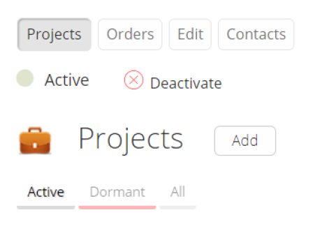

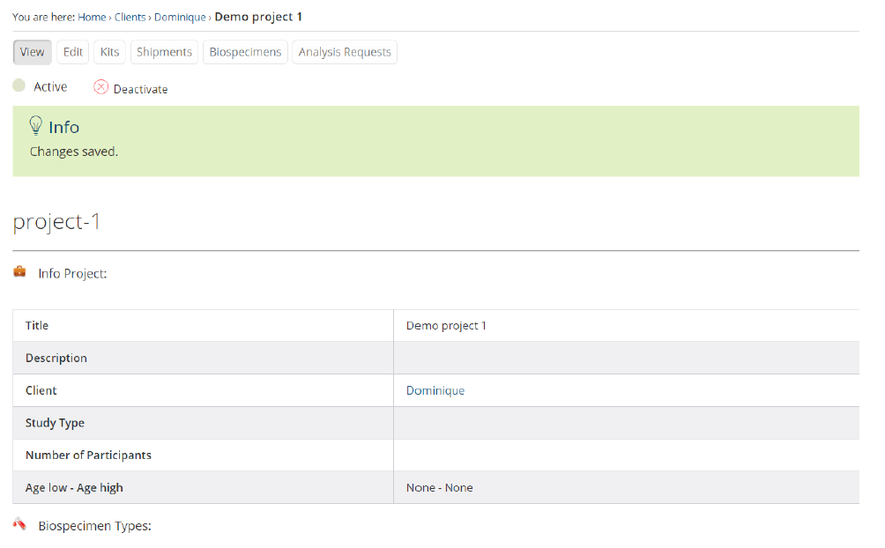

Kits
-----

In the ‘Kits’ tab, select ‘add new kits’.

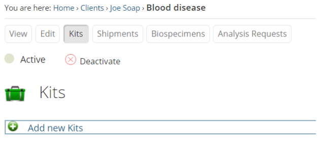

The page will be generated allowing the user to add kits accordingly. In the ``example`` below, prefix text ‘kit’ is used. There will be 1 kit with 3 already generated, therefore, the next kit will start from the next number in sequence i.e. 4. According to the kit template generated, each kit will contain 2 biospecimens. The stock item to be used will be selected from an unmanaged storage which was generated, and the storage will be selected from a managed storage unit which was previously generated.

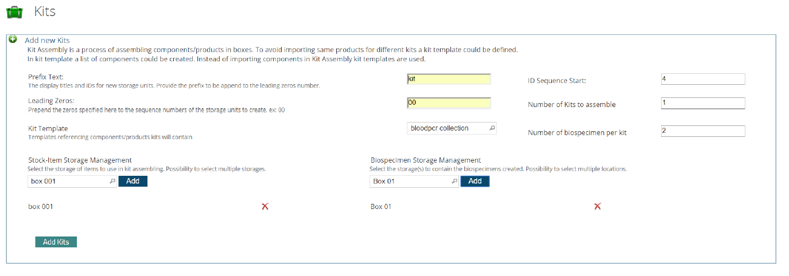

By selecting the kit which has been added, details of the kit can be visualized.

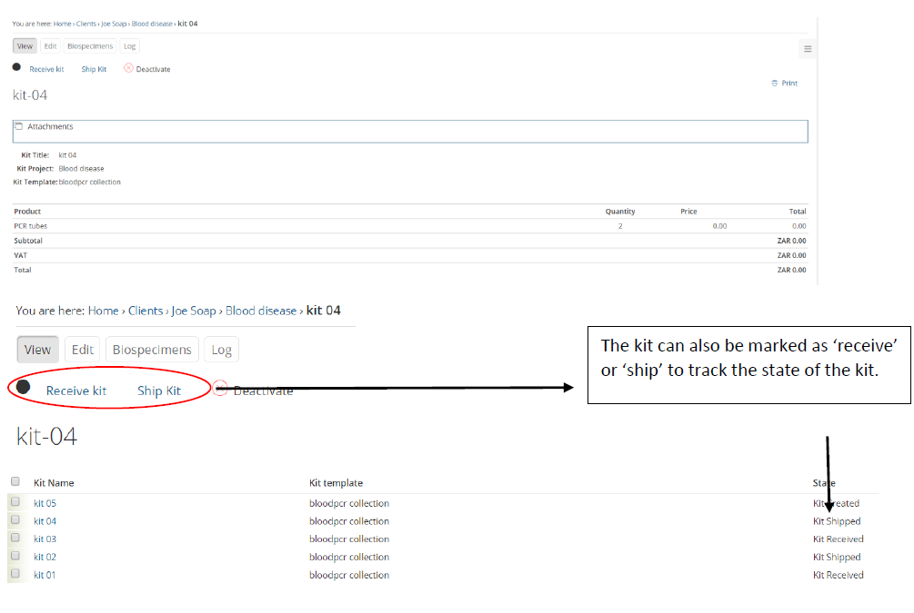

Shipments
---------

Add a shipment by selecting the ‘Add’ button and enter the details of the shipment. Compulsory fields are
indicated by

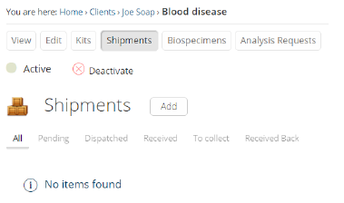

.. Note:: Compulsory fields are also present in the ‘correspondence’ tab and need to be entered to continue.

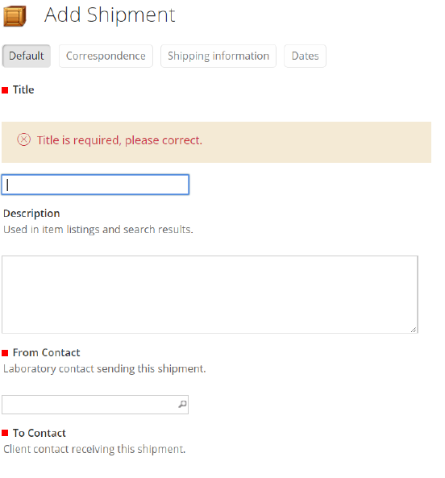

**The process for shipments is as follows;**

#. The Biobank selects 'dispatch' (an email is sent to client to inform them that a shipment has been dispatched)
#. The client logs in with his/her username and password and selects ``projects < shipments < shipment# < and ' receive'``
#. Client fills the tubes with samples
#. Client selects 'collect' and an email is sent back to the biobank. The Biobank then arranges for the courier to now collect shipment
#. The Biobank checks their shipments and selects 'receive back'. An email will be sent to the client informing the client that the kit has been received back at the Biobank.
#. The Biobank selects the specific kit and changes the state of the kit by selecting ‘receive kit'
#. The Biobank unpacks and checks kit contents and selects 'process kit'
#. The Biobank examines the biospecimens in the kit and adds subject ID, volume and other relevant details 
#. The Biobank then selects 'receive sample'
#. The sample is now in storage

.. Note:: barcodes can be scanned in if a scanner is available.

Biospecimens
------------
Biospecimens associated with the project can be viewed in this tab and are generated automatically when a kit is created from a template. 

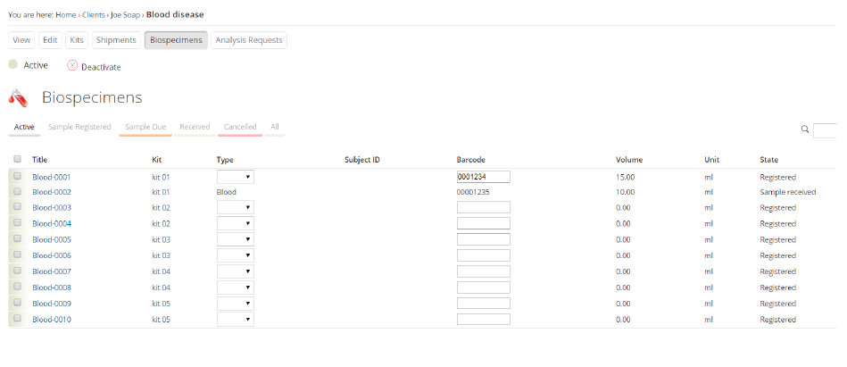

By selecting the biospecimen, the parameters of the specimen can be established, such as, barcode, volume, sample condition etc.

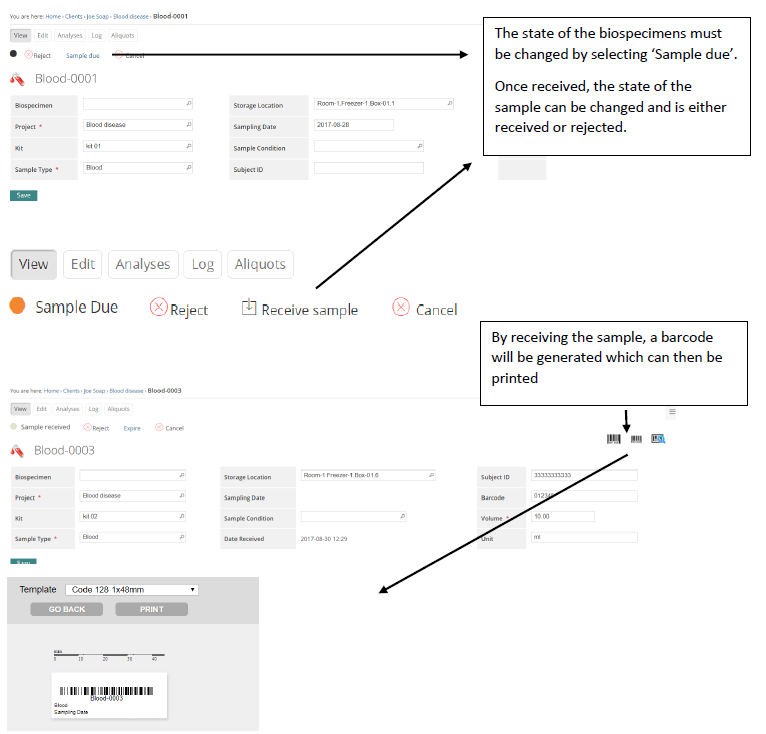

Performing an analysis request
------------------------------

If your biobank can perform an analysis for a client, ensure that you have selected the analyses service to be provided for the project. To do this, select the ‘edit’ tab in the project and select the service to be performed.

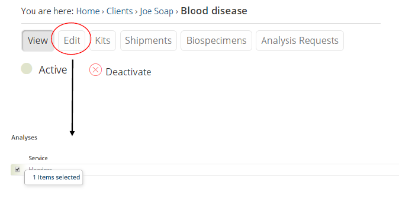

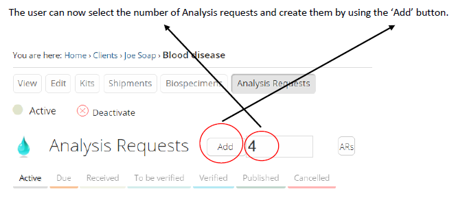

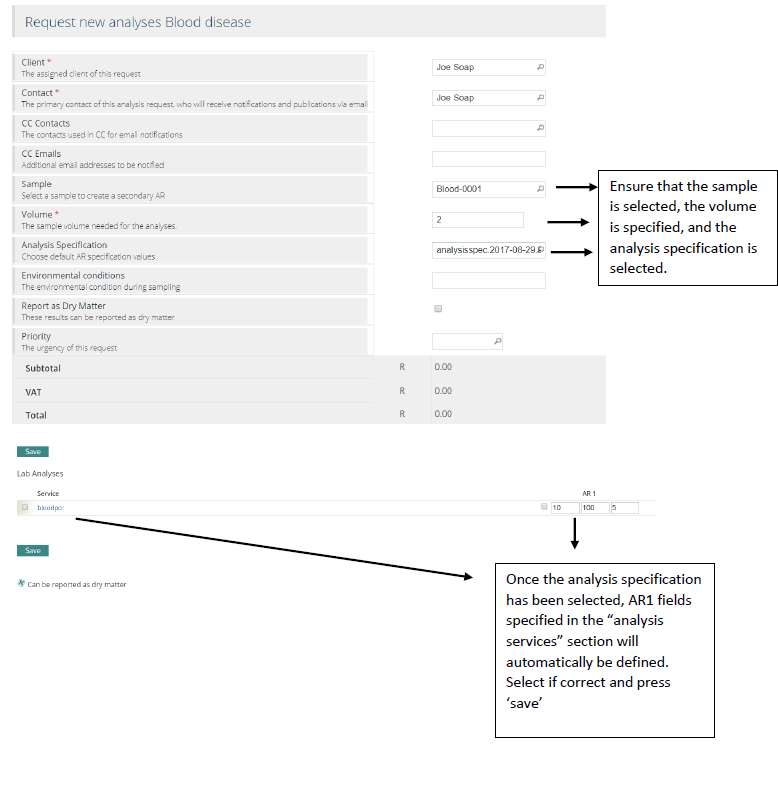

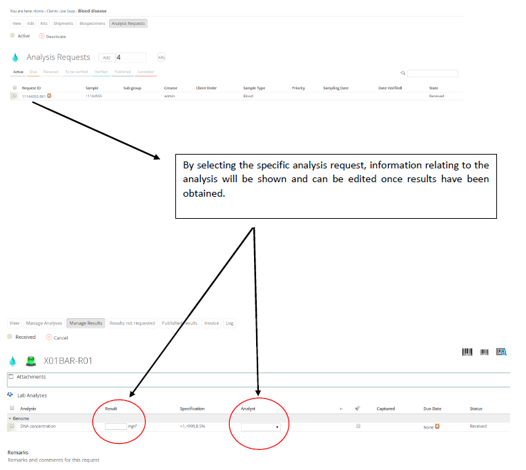

Once the results and the analyst have been selected, the analysis can be submitted by selecting ‘submit’.

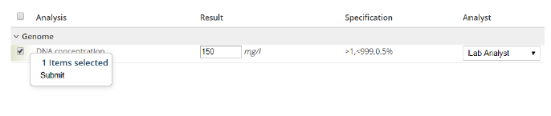

The status of the analysis request will change as the result will need to be verified by another analyst with verification permissions.

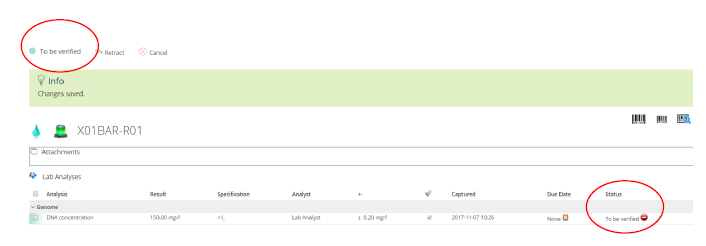

.. Note:: The system dashboard will indicate that an analysis is pending and needs to be verified.

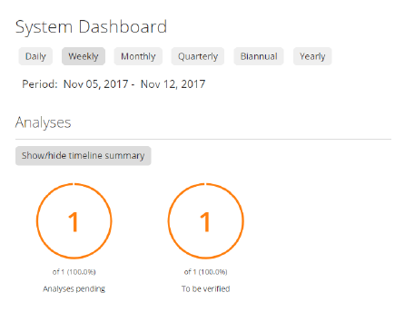

The analyst with verification permission can log in with their username and password and navigate to the analysis request and select ‘Verify’.

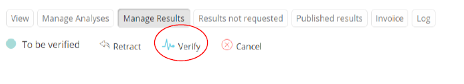

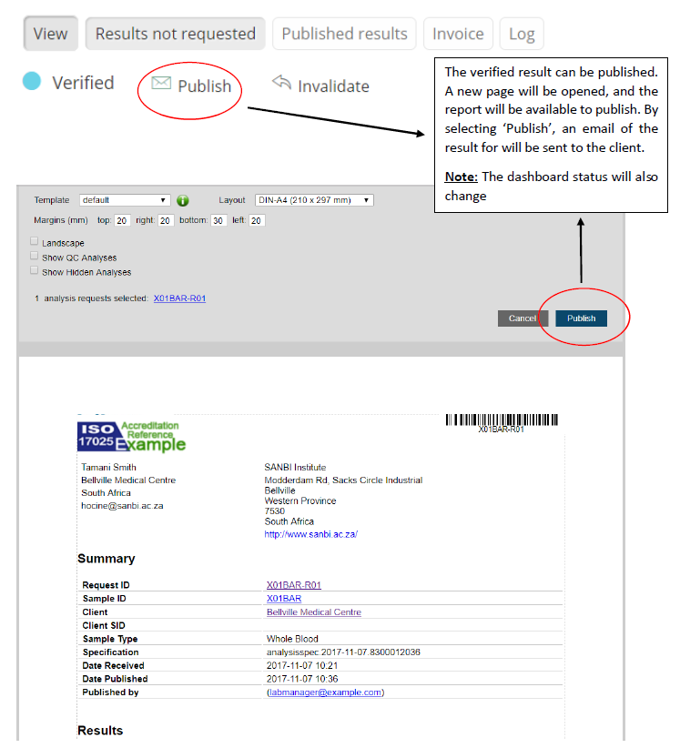

Published results can be emailed to the Client and can also be downloaded by navigating to the Analysis request and selecting the ‘Published results’ tab.

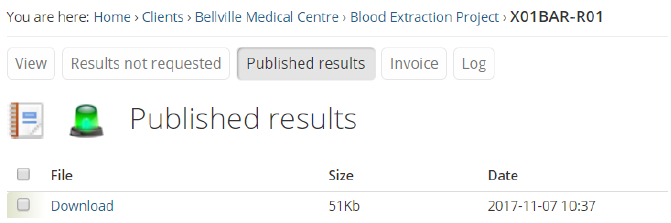

